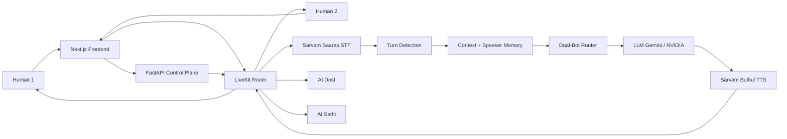

# RoxStar AI Voice Room Assistant

> **"Let it be heard."**  
> Real conversations. Real voices. More human.

Multi-user LiveKit voice room with two AI participants — **AI Dost** and **AI Sathi** — for conversational Hindi/Hinglish dialogue, English understanding, shared room context, speaker-specific memory, deterministic dual-bot routing, barge-in interruption, and unified voice + text interaction.

---

## 1. Overview

RoxStar is a real-time voice room assistant where humans join a LiveKit room and talk with (or about) two distinct AI personas:

| Persona | Role |
| :--- | :--- |
| **AI Dost** | Friendly male Hindi/Hinglish companion (TTS speaker `shubh`) |
| **AI Sathi** | Empathetic female Hindi/Hinglish guide (TTS speaker `priya`) |

**What works in this repository**

- Multi-user LiveKit WebRTC rooms (join / leave / reconnect)
- Sarvam Saaras realtime STT (Hindi, Hinglish, English input)
- Turn detection, eligibility, and silence when bots should not answer every sentence
- Shared conversation context + speaker-specific memory
- Deterministic Dost / Sathi / silence routing with turn lock
- Gemini primary LLM + optional NVIDIA NIM failover
- Sarvam Bulbul v3 TTS published back into LiveKit audio
- Barge-in cancellation of in-flight LLM/TTS when humans interrupt
- Text chat over LiveKit DataChannel with the same orchestration path
- Frontend analytics, chat history, scenarios, documentation, and settings tools (local evidence only)

---

## 2. Assignment Coverage

| Requirement | Implementation | Verification |
| :--- | :--- | :--- |
| LiveKit room | `frontend/hooks/useLiveKitRoom.ts`, `backend/app/api/v1/endpoints/livekit.py` | Token API + browser LIVE state; Phase 3F.9 / 3F.9.1 |
| ≥2 human participants | Same room join (e.g. Rahul / Priya) via LiveKit | Multi-tab / multi-browser join |
| AI Dost participant | LiveKit AI identity + `ParticipantGrid` / classification | Visible when agent/pipeline connected |
| AI Sathi participant | Distinct identity + female voice config | Visible when agent/pipeline connected |
| STT | Sarvam Saaras via backend STT WebSocket gateway | Partial + final transcripts in room UI |
| Hindi / Hinglish | STT language auto + persona prompts | Scenario turns (e.g. “AI kya hota hai?”) |
| English input | Same STT + LLM path | English questions answered in Hindi/Hinglish style |
| Shared context | Orchestrator room context | Multi-turn follow-ups |
| Speaker memory | Speaker profiles / facts in orchestration memory | Cross-speaker recall scenarios |
| Dual-bot routing | Bot router + turn lock | Explicit “AI Dost” / “AI Sathi” mentions |
| Interruption / barge-in | Cancel LLM/TTS + clear audio queue | Phase 3D / 3F live interruption evidence |
| TTS | Sarvam Bulbul v3 → LiveKit `AudioSource` | Humans hear AI audio in room |
| Failure handling | STT/LLM/TTS errors; Gemini→NVIDIA retryable failover | Unit + controlled fallback tests |
| Observability | Structured JSON logs; Events tab; analytics (local) | No secrets in logs/UI |
| Privacy | No raw audio persistence by default; `.gitignore` media; log redaction | Audit + ignore rules |

Do not treat this table as a score. See prior phase verification notes in chat/history for PASS vs PARTIAL items (e.g. provider quota can block live LLM).

---

## 3. Architecture

Three tiers:

1. **Frontend (`frontend/`)** — Next.js 15 + React 19 + `livekit-client`. Room UI, mic publish, remote audio subscribe, DataChannel chat, STT AudioWorklet streaming to the backend, connection lifecycle.
2. **Backend / control plane (`backend/`)** — FastAPI. LiveKit tokens, STT session auth, orchestration (turn detection, context/memory, bot router, LLM manager, TTS publish coordination), health/status APIs, structured logging.
3. **Agent / media layer (`agents/`)** — Python worker protocols and persona configs aligned with LiveKit Agents–style separation (speech, routing, memory interfaces). Runtime AI audio publication is driven through the LiveKit + backend TTS path configured for the room.

**Pipeline (voice)**

```
Human mic → LiveKit → Frontend PCM tap → Sarvam Saaras STT
  → Turn detection / eligibility → Context + speaker memory
  → Dual-bot router → LLM (Gemini → optional NVIDIA)
  → Sarvam Bulbul TTS → LiveKit audio → Human subscribers
```

Text chat joins the same orchestration path via `POST /api/v1/orchestration/text-chat` after DataChannel send.

---

## 4. Architecture Diagram



More detail: [docs/architecture.md](docs/architecture.md), [docs/orchestration.md](docs/orchestration.md), [docs/architecture/sequence-diagrams.md](docs/architecture/sequence-diagrams.md).

---

## 5. Repository Structure

```
ROXSTAR_PROJECT/
├── frontend/                 # Next.js room UI + LiveKit client
├── backend/                  # FastAPI control plane + orchestration
├── agents/                   # Agent protocols, personas, worker entry
├── docs/                     # Architecture, ADRs, routing, speech, demo
├── scripts/                  # run_backend.ps1, run_agents.ps1, run_tests.ps1
├── tests/                    # Root integration / contract tests
├── docker-compose.yml        # Optional Redis + Postgres/pgvector
├── .env.example              # Safe placeholders only
└── README.md                 # This file
```

---

## 6. Prerequisites

- Node.js 18+
- Python 3.10+ (3.13 used in development)
- npm
- LiveKit Cloud (or self-hosted) project
- API keys: Sarvam (STT + TTS), Google Gemini; optional NVIDIA NIM
- Optional: Docker for Redis / Postgres (`docker compose up -d`)

---

## 7. Environment Setup

**Never commit real `.env` files.** Copy examples only:

```bash
cp .env.example .env
cp backend/.env.example backend/.env
cp frontend/.env.example frontend/.env.local
```

Fill placeholders in `.env` / `backend/.env` (names only — use your own secrets):

| Variable | Purpose |
| :--- | :--- |
| `LIVEKIT_URL` | LiveKit WebSocket URL |
| `LIVEKIT_API_KEY` / `LIVEKIT_API_SECRET` | Token minting |
| `SARVAM_API_KEY` | Sarvam Saaras STT |
| `SARVAM_TTS_API_KEY` | Sarvam Bulbul TTS (separate from STT key) |
| `GEMINI_API_KEY` | Primary LLM |
| `NVIDIA_API_KEY` | Optional failover LLM |
| `NEXT_PUBLIC_BACKEND_URL` | Frontend → API (`http://127.0.0.1:8000`) |

All `*.example` files ship **placeholders only** (`your_*_placeholder` patterns).

---

## 8. Running Locally

### Backend

```bash
# from repo root
pip install -r backend/requirements.txt
# Windows helper: .\scripts\run_backend.ps1
# or:
set PYTHONPATH=.
uvicorn backend.app.main:app --reload --port 8000
```

- Health: http://127.0.0.1:8000/health  
- Status: http://127.0.0.1:8000/api/v1/system/status  

### Agents (optional worker process)

```bash
pip install -r agents/requirements.txt
python -m agents.app.main
# or: .\scripts\run_agents.ps1
```

### Frontend

```bash
cd frontend
npm install
npm run dev
```

Open http://127.0.0.1:3000/room/demo  
Quick join: http://127.0.0.1:3000/room/demo?room=roxstar-test&name=Rahul&auto=1  

Optional infra:

```bash
docker compose up -d
```

---

## 8b. Production notes (pre-deploy)

**Do not horizontally scale the API while `AI_MEDIA_IN_BACKEND=true` (default).**  
AI Dost / AI Sathi LiveKit publishers and in-memory orchestration live inside the FastAPI process.

Production backend must run as:

- `ENVIRONMENT=production`
- **ONE** process / **ONE** uvicorn worker
- **NO** `--reload`
- WebSocket support for `/api/v1/stt/stream`
- Explicit `CORS_ORIGINS` (not localhost defaults; no `*`)
- Required secrets: LiveKit trio, `STT_TOKEN_SECRET`, Sarvam STT (+ TTS key), Gemini (NVIDIA optional)

```bash
# Backend (repo root, PYTHONPATH=.)
uvicorn backend.app.main:app --host 0.0.0.0 --port 8000

# Frontend (set NEXT_PUBLIC_BACKEND_URL=https://your-api before build)
cd frontend && npm ci && npm run build && npm start
```

Liveness: `GET /health` · Readiness (config flags only): `GET /ready`  
OpenAPI `/docs` is disabled when `ENVIRONMENT=production`.  
Agents worker is **not** required when `AI_MEDIA_IN_BACKEND=true`.  
Redis/Postgres via `docker-compose.yml` are optional and **not** required by the runtime voice path.

---

## 9. Demo Walkthrough (Reviewer)

1. Start backend + frontend (and agents if required for your deploy path).
2. Open two browsers/profiles → join the **same room** as Rahul and Priya.
3. Confirm topbar **LIVE**, both humans visible, AI Dost / AI Sathi cards present when connected.
4. Speak or type Hindi/Hinglish (e.g. “AI kya hota hai?”) and an English question.
5. Address bots explicitly: “AI Dost, tum batao.” / “AI Sathi, tum batao.”
6. Try a follow-up that needs context; confirm one bot response and turn lock.
7. During TTS, interrupt with a new meaningful turn (barge-in).
8. Leave and rejoin; confirm LIVE again.
9. Optionally open Analytics / Chat History / Test Scenarios / Documentation from the sidebar (local evidence tools).

Additional notes: [docs/demo/demo-guide.md](docs/demo/demo-guide.md) (refresh locally if still Phase-1 framed).

---

## 10. LLM Failover (Gemini → NVIDIA)

Configured in backend settings:

- Primary: Google Gemini (`LLM_PRIMARY_PROVIDER=gemini`)
- Fallback: NVIDIA NIM when enabled (`LLM_ENABLE_FALLBACK=true`)
- Retryable: 429 / quota / 503 / connection / timeout  
- Non-retryable: auth / invalid request / invalid model / cancel / config  
- Max two provider attempts; no fallback loop; one canonical response

Tests: `backend/tests/test_llm_fallback.py`, `backend/tests/test_fallback_smoke.py`.

---

## 11. Testing

```bash
# Backend
cd backend && python -m pytest -q

# Agents
cd agents && python -m pytest -q

# Frontend
cd frontend
npm test
npm run type-check
npm run build
```

Windows convenience: `.\scripts\run_tests.ps1`.

---

## 12. Security & Privacy

- Real credentials live only in local `.env` / `backend/.env` / `frontend/.env.local` (gitignored).
- Frontend never embeds API keys; only `NEXT_PUBLIC_BACKEND_URL`.
- Structured loggers redact tokens/authorization material.
- Raw audio is processed in memory and is not persisted by default; media extensions are gitignored.
- Analytics / chat history on the frontend are local-browser evidence tools — do not put customer secrets there.

---

## 13. Known Limitations

- Gemini **free-tier quota** can return HTTP 429 and block live AI replies until quota resets or a key with quota is configured; NVIDIA fallback must be valid to cover that path.
- Optional Postgres/Redis via Compose are for persistence/cache experiments; core demo can run without them depending on configuration.
- Dev-only React StrictMode / Next.js hydration warnings may appear in the browser overlay; they are not LiveKit connection failures (see Phase 3F.9.1 lifecycle hardening).
- `docs/feature-checklist.md` originated in Phase 1; prefer **§2 Assignment Coverage** in this README for submission status.

---

## 14. Submission Hygiene

Before packaging or first `git init` / commit:

1. Confirm `.env`, `backend/.env`, and `frontend/.env.local` are **not** included.
2. Confirm `node_modules/`, `.next/`, `.venv/`, `*.log`, `scenario_results.json`, and `.inspect_pkgs/` are excluded.
3. Ship `.env.example` files only.
4. Do not commit screenshots, raw audio, or local scenario result dumps.

This workspace was audited for Phase 3F.10 packaging: **no git history** was present at audit time, so no historical secret rewrite was required. If you later discover a committed secret, rotate the key and treat history scrubbing as a manual ops step (do not force-rewrite casually).

---

## License / Attribution

Assignment prototype. Sarvam, LiveKit, Google Gemini, and NVIDIA NIM are third-party services — use under their respective terms.
