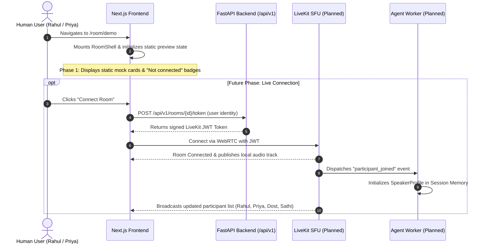
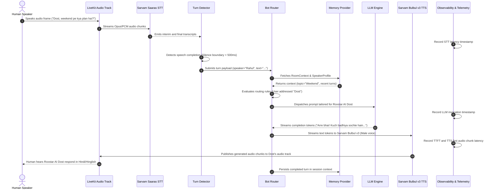
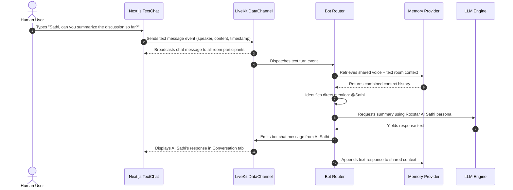
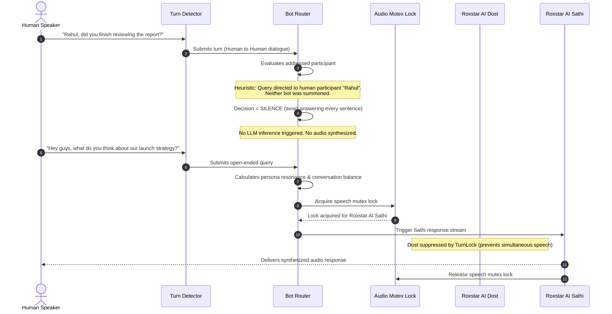

# Sequence Diagrams: RoxStar AI Voice Room Assistant

The following sequence diagrams specify the core workflows and interaction protocols across the human participants, frontend client, backend gateway, LiveKit SFU, agent workers, speech processors, LLM engine, and memory subsystems.

> [!NOTE]
> Diagrams 2 through 5 detail **PLANNED** runtime behaviors for future implementation phases, built upon the Phase 1 protocol foundations.

---

## 1. Human Participant Joins Room



---

## 2. Voice Request & Pipeline Flow (Planned)



---

## 3. Text Chat Request Flow (Planned)



---

## 4. Bot Routing & Dual-Bot Arbitration (Planned)



---

## 5. Human Interruption / Barge-In Flow (Planned)

```mermaid
sequenceDiagram
    autonumber
    actor Human as Human Speaker
    participant LK as LiveKit SFU
    participant VAD as Turn Detector / VAD
    participant Router as Bot Router
    participant TTS as Sarvam Bulbul TTS
    participant LLM as LLM Engine

    Note over TTS,LK: AI Dost is actively speaking audio stream to room...
    Human->>LK: Starts speaking: "Wait, Dost, ek second ruko..."
    LK->>VAD: Receives incoming human audio energy
    
    VAD->>Router: Emits BargeInSignal(speaker="Rahul", timestamp)
    
    critical Instant Cancellation
        Router->>TTS: cancel_playback() -> Immediately drop audio output buffer
        TTS->>LK: Clear active audio track queue
        Router->>LLM: cancel_generation() -> Abort in-flight completion stream
    end

    Note over Human,LK: AI audio immediately stops; human speech is heard without collision
    VAD->>Router: Continues buffering human speech as new incoming turn
```
