# System Architecture Diagram

The following Mermaid diagram outlines the complete multi-tier architecture of the **RoxStar AI Voice Room Assistant**, illustrating the clean decoupling between the client UI, FastAPI backend, LiveKit WebRTC transport, agent worker orchestration, speech providers, memory tier, and observability engine.

```mermaid
graph TB
    subgraph ClientTier ["Frontend Client Tier (Next.js / TypeScript)"]
        direction TB
        UI_Shell["Room Shell UI (/room/demo)"]
        Grid["Participant Grid<br/>(Rahul, Priya, Dost, Sathi)"]
        Visualizer["Voice Visualizer Component"]
        ConvPanel["Conversation & Chat Panel"]
        IntelPanel["Intelligence Panel<br/>(Context, Memory, Routing, Pipeline)"]
        LK_Client["LiveKit React SDK Client<br/>(WebRTC Audio & DataChannel)"]
        
        UI_Shell --> Grid
        UI_Shell --> Visualizer
        UI_Shell --> ConvPanel
        UI_Shell --> IntelPanel
        UI_Shell -.-> LK_Client
    end

    subgraph BackendTier ["Backend Services (FastAPI / Python)"]
        direction TB
        API_Gateway["FastAPI Gateway"]
        HealthEndpoint["/health & /system/status"]
        ConfigManager["Config & Settings (Pydantic BaseSettings)"]
        TokenService["LiveKit Token Minting Service (Planned)"]
        Schemas["Pydantic Data Contracts & Schemas"]
        JSONLogger["Structured JSON Logging & Sanitizer"]

        API_Gateway --> HealthEndpoint
        API_Gateway --> TokenService
        API_Gateway --> ConfigManager
        API_Gateway --> Schemas
        API_Gateway --> JSONLogger
    end

    subgraph TransportTier ["Transport & SFU (LiveKit Cloud / Server)"]
        direction TB
        LK_Room["LiveKit Voice Room SFU"]
        AudioTracks["WebRTC Multi-track Audio (Opus)"]
        DataChannel["WebRTC DataChannel (State & Transcripts)"]

        LK_Room --> AudioTracks
        LK_Room --> DataChannel
    end

    subgraph AgentTier ["Agent Worker & Orchestration Layer (Python)"]
        direction TB
        AgentWorker["LiveKit Agent Worker Process"]
        TurnMgr["Turn Detector & Barge-in Monitor"]
        Router["Bot Router (Dost vs. Sathi vs. Silence)"]
        TurnLock["Single-Speaker Audio Mutex Lock"]

        subgraph Personas ["AI Personas"]
            DostPersona["Roxstar AI Dost<br/>(Male, Friendly Hindi/Hinglish)"]
            SathiPersona["Roxstar AI Sathi<br/>(Female, Warm Hindi/Hinglish)"]
        end

        AgentWorker --> TurnMgr
        TurnMgr --> Router
        Router --> TurnLock
        Router --> DostPersona
        Router --> SathiPersona
    end

    subgraph ProvidersTier ["Speech & AI Provider Integrations"]
        direction TB
        STT_Interface["SpeechToTextProvider Protocol"]
        SarvamSTT["Sarvam Saaras STT (Streaming WebSocket)"]
        LLM_Interface["LanguageModelProvider Protocol"]
        LLM_Service["Configurable LLM Engine"]
        TTS_Interface["TextToSpeechProvider Protocol"]
        SarvamTTS["Sarvam Bulbul v3 TTS (Streaming Audio)"]

        STT_Interface -.-> SarvamSTT
        LLM_Interface -.-> LLM_Service
        TTS_Interface -.-> SarvamTTS
    end

    subgraph MemoryTier ["Memory & State Management"]
        direction TB
        Memory_Interface["MemoryProvider Protocol"]
        RedisSession["Redis Session Cache<br/>(Ephemeral Turns & Locks)"]
        PGVector["PostgreSQL + pgvector<br/>(Persistent Profiles & Semantic Memory)"]

        Memory_Interface -.-> RedisSession
        Memory_Interface -.-> PGVector
    end

    subgraph TelemetryTier ["Observability & Metrics"]
        direction TB
        MetricCollector["Pipeline Latency Metric Collector"]
        TraceLogger["Contextual JSON Telemetry"]
    end

    %% Inter-tier connections
    LK_Client <==>|"WebRTC Tracks"| LK_Room
    LK_Client <==>|"DataChannel"| LK_Room
    UI_Shell <-->|"HTTP / REST"| API_Gateway
    
    LK_Room <==>|"WebRTC Tracks"| AgentWorker
    LK_Room <==>|"DataChannel Events"| AgentWorker

    AgentWorker --> STT_Interface
    TurnMgr --> Memory_Interface
    Router --> LLM_Interface
    DostPersona --> TTS_Interface
    SathiPersona --> TTS_Interface

    AgentWorker --> MetricCollector
    AgentWorker --> TraceLogger
    API_Gateway --> TraceLogger

    classDef implemented fill:#1e293b,stroke:#8b5cf6,stroke-width:2px,color:#f8fafc;
    classDef planned fill:#0f172a,stroke:#475569,stroke-width:1px,stroke-dasharray: 5 5,color:#94a3b8;

    class UI_Shell,Grid,ConvPanel,IntelPanel,API_Gateway,HealthEndpoint,ConfigManager,Schemas,JSONLogger,STT_Interface,TTS_Interface,LLM_Interface,Memory_Interface,Router,DostPersona,SathiPersona implemented;
    class LK_Client,TokenService,LK_Room,AudioTracks,DataChannel,AgentWorker,SarvamSTT,SarvamTTS,LLM_Service,RedisSession,PGVector planned;
```

