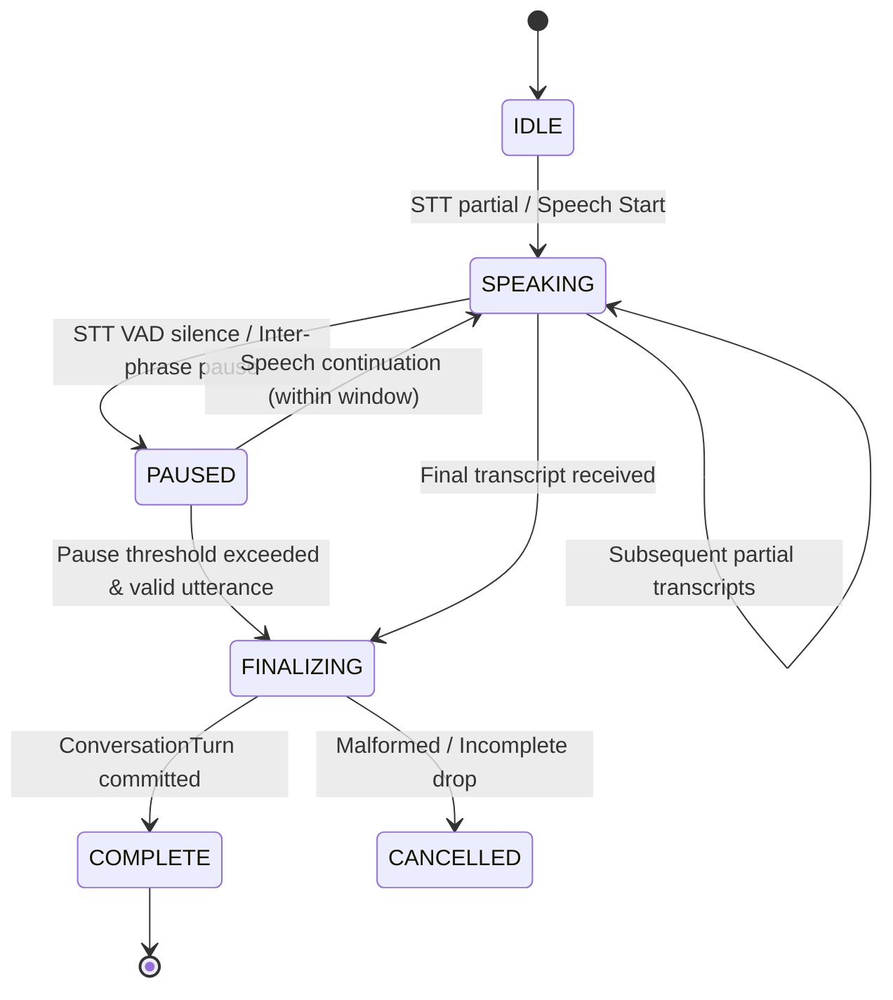
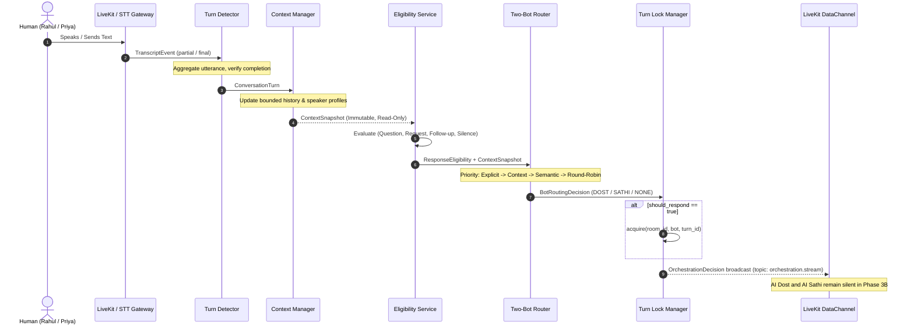
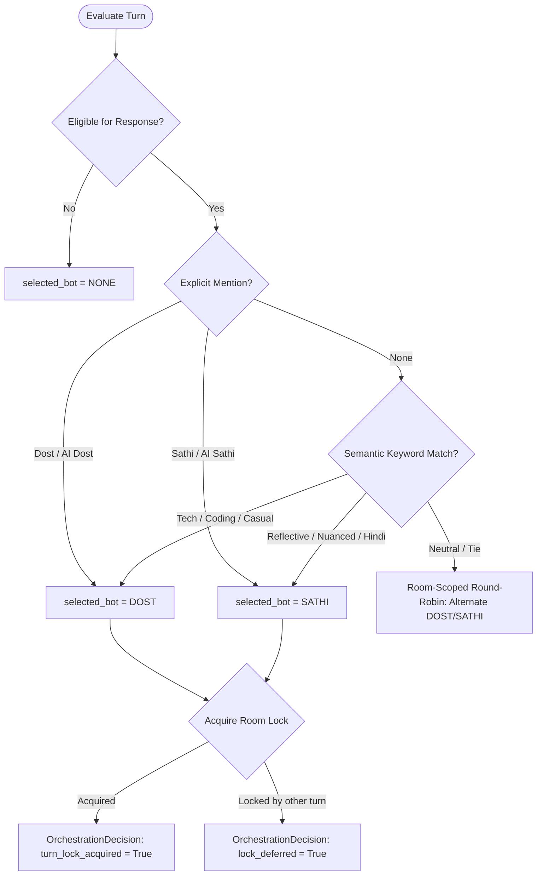

# RoxStar Voice Room Assistant — Phase 3B Orchestration Architecture

This document specifies the conversation orchestration layer for the RoxStar AI Voice Room Assistant. Phase 3B establishes deterministic turn detection, bounded in-memory multi-user room context, response eligibility classification, two-bot arbitration (AI Dost vs. AI Sathi), room-scoped single-speaker turn locking, and observability.

---

## 1. Turn Detection Architecture

The Turn Detection layer aggregates streaming partial speech transcripts and finalized text/voice utterances into unified `ConversationTurn` models.



### Key Responsibilities:
- **Interim Grouping:** Sub-second partial transcripts (e.g. `"AI kya"`, `"AI kya hota"`, `"AI kya hota hai"`) update the active turn in place without generating separate turns.
- **Participant Association:** Active turns are strictly keyed by `(room_id, participant_identity)`. Turns from distinct speakers never merge.
- **Duplicate Protection:** Bounded LRU cache of processed transcript event IDs suppresses duplicate finals.

---

## 2. Pause Handling & Incomplete Utterances

### Pause Continuation
- Configurable threshold: `TURN_PAUSE_THRESHOLD_MS = 1500` (default: 1500 ms).
- A 1500 ms pause marks a candidate boundary, but does **not** automatically finalize an incomplete sentence.
- Example:
  ```
  User: "Cloud computing kya hai..."
  [Pause ~1200ms]
  User: "...aur iska use companies kaise karti hain?"
  ```
  Transitions from `SPEAKING` ➔ `PAUSED` ➔ `SPEAKING` ➔ `COMPLETE`, producing **one logical turn**.

### Incomplete Sentence Heuristics (`incomplete_utterance.py`):
Utterances ending with the following cues are classified as incomplete and do not trigger an AI response:
1. **Trailing Conjunctions:** `aur`, `and`, `ya`, `or`, `lekin`, `but`, `ki`, `toh`, `so`
2. **Trailing Postpositions / Prepositions:** `mein`, `me`, `ke`, `ka`, `ki`, `ko`, `se`, `par`, `pe`, `of`, `in`, `with`, `to`
3. **Trailing Ellipsis:** `...`, `…`
4. **Hanging Interrogatives:** Stems like `"AI kya..."`, `"Cloud computing mein..."`, `"Shah Rukh Khan ki..."` without predicates.

---

## 3. Master Orchestration Pipeline

The execution sequence enforces that **room context updates precede response eligibility**:



---

## 4. Response Eligibility Rules (`response_eligibility.py`)

Deterministic classifier answering: *"Should an AI companion respond to this turn?"*

| Trigger Type | Heuristic Cues | `should_respond` | Example |
| :--- | :--- | :---: | :--- |
| `INCOMPLETE_UTTERANCE` | Trailing conjunctions, ellipsis, postpositions | `False` | `"Cloud computing kya..."` |
| `ACKNOWLEDGEMENT` | `"okay"`, `"theek hai"`, `"samajh gaya"`, `"got it"`, `"nice"` | `False` | `"Okay, samajh gaya."` |
| `CASUAL_STATEMENT` | Statements with no bot name, question, or request | `False` | `"Kal college mein event hai."` |
| `EXPLICIT_BOT_ADDRESS` | Mentioning `"Dost"`, `"AI Dost"`, `"Sathi"`, `"AI Sathi"` | `True` | `"AI Dost, explain AI."` |
| `DIRECT_QUESTION` | Question words (`kya`, `kyun`, `how`, `what`) or `?` | `True` | `"AI kya hota hai?"` |
| `DIRECT_REQUEST` | Request verbs (`samjhao`, `batao`, `explain`, `please`) | `True` | `"Machine learning simple batao."` |
| `FOLLOW_UP` | Follow-up cues (`thoda aur`, `unki`, `aur batao`) + prior context | `True` | `"Thoda aur simple batao."` |

---

## 5. Two-Bot Routing & Arbitration (`bot_router.py`)

Guarantees:
- **Single-Bot Invariant:** The router ALWAYS selects exactly one bot: `DOST`, `SATHI`, or `NONE`.
- **Never Both:** Never selects `DOST + SATHI`.



### Deterministic Routing Priority:
1. **Eligibility Check:** Ineligible turns route to `NONE` (`reason="turn_not_eligible"`).
2. **Explicit Addressing:** Mentions of `"Dost"` or `"Sathi"` take absolute precedence.
3. **Semantic Keywords (Deterministic Heuristics):**
   - **DOST:** `coding`, `code`, `tech`, `python`, `api`, `cloud`, `fast`, `bhai`, `yaar`
   - **SATHI:** `feeling`, `bhavna`, `relationship`, `life`, `samajh`, `thoughtful`, `calm`
   *(Documented explicitly as deterministic heuristics, not LLM semantic understanding)*.
4. **Stable Room-Scoped Fallback:** Alternates `DOST` ➔ `SATHI` ➔ `DOST` (initial room default is `DOST`).

---

## 6. Room-Scoped Turn Locking (`turn_lock.py`)

- **Mutex Semantics:** Only one bot can hold the audio response lock for a room at any time.
- **Room Isolation:** Locking Room A never impacts Room B.
- **Lock Metadata:**
  ```json
  {
    "room_id": "room-demo",
    "selected_bot": "DOST",
    "turn_id": "turn-98b7f83a",
    "acquired_at": "2026-09-18T02:00:00Z",
    "expires_at": "2026-09-18T02:00:15Z"
  }
  ```
- **Deferred Turns:** If Priya asks a question while Dost holds the lock for Rahul, Priya's turn is marked with `turn_lock_acquired = false` and `lock_deferred = true` (`reason = "room_response_locked"`).

---

## 7. Multi-User Conversation Context (`conversation_context.py`)

- **Bounded FIFO Window:** Retains the most recent `MAX_CONTEXT_TURNS = 20` turns.
- **Strict Speaker Separation:**
  - Fact extraction and speaker memories are strictly keyed by authenticated `participant_identity`.
  - Rahul's facts (`"I like cricket"`) and Priya's facts (`"My name is Priya"`) are never merged.
- **Context Snapshot:** Generates a read-only, immutable snapshot before each eligibility check.
- **Zero Persistent DB:** Purely in-memory ephemeral context for Phase 3B. Persistent memory remains a future milestone.

---

## 8. Voice + Text Unification

Text chat enters the identical orchestration pipeline:
```
Voice: STT WebSocket ➔ TranscriptEvent
Text: POST /api/v1/orchestration/text-chat ➔ TranscriptEvent
             ↓
        TurnDetector
             ↓
      ConversationTurn
             ↓
  Context Update + Snapshot
             ↓
     Response Eligibility
             ↓
         Bot Router
             ↓
     Turn Lock Manager
             ↓
   OrchestrationDecision
```

### Security & Anti-Bypass Guarantees:
- `POST /api/v1/orchestration/text-chat` requires a valid cryptographically signed session token.
- `room_name` and `participant_identity` are validated against token claims.
- Arbitrary client identities are strictly rejected with HTTP 401/403.

---

## 9. Observability & Telemetry Metrics

For every finalized turn, latency is measured using system high-resolution counters:

| Metric | Description |
| :--- | :--- |
| `stt_to_turn_ms` | Elapsed time from STT event ingestion to turn detection |
| `turn_to_eligibility_ms` | Elapsed time to complete context update and evaluate eligibility |
| `eligibility_to_routing_ms` | Elapsed time to execute bot arbitration |
| `routing_to_lock_ms` | Elapsed time to acquire or evaluate room turn lock |

Metrics are broadcast in the `orchestration.event` message over the LiveKit DataChannel.

---

## 10. Scope Boundary & Future LLM Boundary

Phase 3B deliberately terminates at `OrchestrationDecision` and the AI Response Request contract:
- **No LLM Generation:** Zero OpenAI/Gemini completions.
- **No Speech Generation:** Zero Sarvam Bulbul TTS.
- **No Audio Publication:** AI agents remain silent on WebRTC tracks.
- **Standby UI:** AI Dost and AI Sathi cards continue displaying `STANDBY / FUTURE`.
