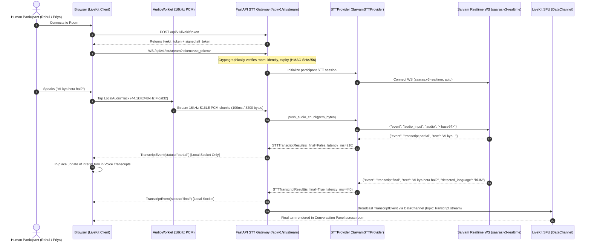

# Phase 3A: Real-Time Speech-to-Text (STT) Architecture & Specification

## 1. Overview

Phase 3A implements an Indian multilingual speech recognition pipeline for the RoxStar AI Voice Room Assistant. The pipeline streams audio from the LiveKit human microphone track through an AudioWorklet resampler into a backend WebSocket gateway, which interfaces with Sarvam AI's `saaras:v3-realtime` streaming engine via a pluggable provider abstraction (`SpeechToTextProvider`).

---

## 2. Architecture & Data Flow



---

## 3. Pluggable Provider Abstraction (`SpeechToTextProvider`)

The speech subsystem is decoupled through a runtime-checkable Python `Protocol`:

```python
@runtime_checkable
class SpeechToTextProvider(Protocol):
    async def connect(self, room_name: str, participant_identity: str, participant_name: str) -> None: ...
    async def push_audio_chunk(self, pcm_bytes: bytes) -> None: ...
    async def receive_events(self) -> AsyncIterator[STTTranscriptResult]: ...
    async def flush(self) -> None: ...
    async def close(self) -> None: ...
```

### Result Schema (`STTTranscriptResult`)
- `text`: Transcribed utterance segment.
- `is_final`: `False` for interim partials; `True` for finalized speech turns.
- `detected_language`: Detected BCP-47 language tag (`hi-IN`, `en-IN`, `hi-Latn`).
- `language_confidence`: Model confidence score (0.0 to 1.0).
- `latency_ms`: Elapsed duration from speech start to transcript generation.
- `raw_event`: Provider-specific raw payload for telemetry and debugging.

---

## 4. Sarvam Realtime Protocol (`saaras:v3-realtime`)

- **WebSocket URL**: `wss://api.sarvam.ai/speech-to-text-realtime/ws`
- **Query Parameters**:
  - `model=saaras:v3-realtime`
  - `language_code=auto`
  - `sample_rate=16000`
- **Authentication**: `api-subscription-key: <SARVAM_API_KEY>` header.
- **Audio Chunks**: Base64-encoded binary 16kHz S16LE PCM sent via `{"event": "audio_input", "audio": "<base64>"}`.
- **Event Lifecycle**:
  - `session.begin`: Session initialization confirmed.
  - `vad.speech_start`: Voice activity detected; utterance start timer initiated.
  - `transcript.partial`: Interim hypothesis emitted.
  - `transcript.final`: Turn finalized with detected language.
  - `vad.speech_end`: Voice activity ends.
  - `session.end`: Clean teardown.
  - `error`: Structured error parsing (`code`, `is_fatal`, `message`).

---

## 5. AudioWorklet Resampling (Hardware Rate -> 16kHz PCM S16LE)

Browsers run AudioContexts at hardware-native rates (typically 48,000 Hz or 44,100 Hz). The `stt-resampler-processor` AudioWorklet:
1. Taps the `LocalAudioTrack.mediaStreamTrack` published to LiveKit without invoking `getUserMedia()` a second time.
2. Mixes multi-channel audio to mono.
3. Resamples down to 16,000 Hz using fractional linear interpolation.
4. Quantizes Float32 `[-1.0, 1.0]` into 16-bit linear signed PCM (`Int16Array`).
5. Buffers 1,600 samples (100ms = 3,200 bytes) and transfers them zero-copy to the main thread via `postMessage`.

---

## 6. Cryptographic STT Authentication & Session Binding

### STT Token Specification
- Format: `<payload_b64>.<signature_b64>`
- Claims:
  ```json
  {
    "room_name": "roxstar-test",
    "participant_identity": "human-a1b2c3d4",
    "display_name": "Rahul",
    "iat": 1726615200,
    "exp": 1726617000
  }
  ```
- Signature: `HMAC-SHA256(payload_b64, secret)`
- Expiry: 30 minutes default (`STT_TOKEN_EXPIRY_MINUTES`).

### Transport Security Decision
- Browser `WebSocket` API does not permit custom headers during the HTTP upgrade handshake.
- To maintain universal browser compatibility, the short-lived signed token is passed via query string:
  `/api/v1/stt/stream?token=<stt_token>`
- **Security controls enforced**:
  1. Token is strictly short-lived (15–30 minutes).
  2. Tokens and authenticated URLs are **never logged**.
  3. Sensitive values are recursively scrubbed by `sanitize_data` in structured logging.
  4. Query parameters are redacted from server logs.
  5. Tokens are cryptographically bound to `room_name` and `participant_identity`. Mismatched requests or spoofing attempts are rejected with WebSocket close code `4403`.
  6. WSS (`wss://`) is enforced in production.

---

## 7. Multi-User Participant Isolation & Bandwidth Optimization

- **Zero Audio Mixing**: Each human participant maintains an independent, isolated `SarvamSTTProvider` session managed by `STTSessionManager`.
- **Bandwidth Conservation**:
  - Interim partial transcripts are sent **only** to the speaker's local WebSocket.
  - Finalized transcripts are sent to the local WebSocket **and** broadcasted to the room over the LiveKit DataChannel (`topic: transcript.stream`).
  - This prevents high-frequency partial updates from saturating WebRTC data channels in multi-user rooms.

---

## 8. Multilingual Handling & Latency Tracking

- **Default Configuration**: `SARVAM_STT_LANGUAGE=auto` allows dynamic code-mixing and seamless transitions between Hindi, English, and Hinglish.
- **Language Detection**: Each final transcript provides `detected_language` (`hi-IN`, `en-IN`, etc.) and `language_confidence`.
- **Latency Measurement**:
  - Utterance timer starts on `vad.speech_start` or initial chunk receipt.
  - Latency is calculated on partial (`partial_latency_ms`) and final (`final_latency_ms`).
  - Displayed honestly in the UI (e.g. `420 ms`) with zero artificial delays or fabricated metrics.

---

## 9. Fault Isolation & Error Recovery

- **Decoupled Failure Domain**: The STT pipeline is strictly decoupled from the WebRTC media layer. If the STT gateway or Sarvam WebSocket disconnects, human-to-human WebRTC audio and remote playback remain 100% operational.
- **Explicit Mock Provider**: Mock mode is only enabled when `STT_PROVIDER=mock` is explicitly configured. If `SARVAM_API_KEY` is missing while `STT_PROVIDER=sarvam`, the system enters `DISABLED/CONFIGURATION_ERROR` and never produces simulated transcripts or fake latency.

---

## 10. Cost & Concurrency Considerations

- Realtime STT billing is based on connected audio duration.
- Disconnecting the microphone or leaving the room immediately triggers WebSocket teardown and stops Sarvam billing.
- In-flight audio buffers are flushed upon muting to minimize billed stream time.
